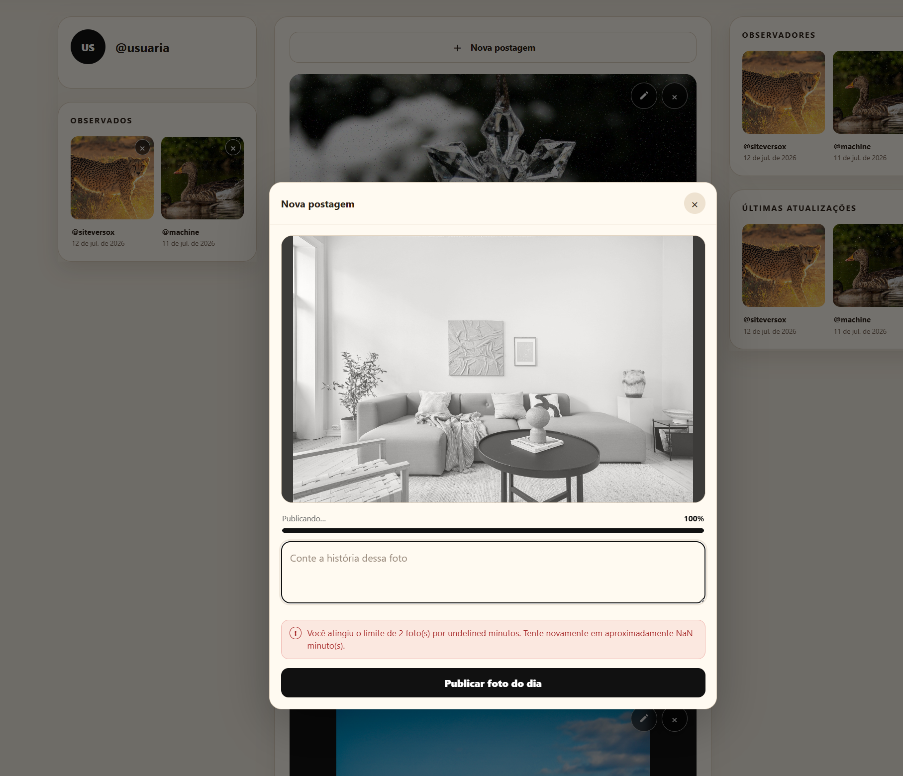
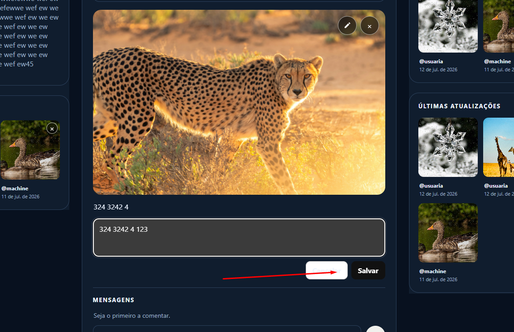
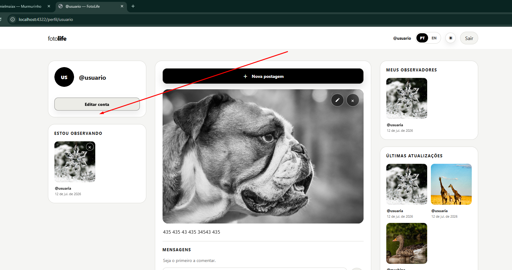

site-murm
Instrucoes

Voce pode ter a visao de conjunto antes
Mas Faca cada coisa de uma vez com cuidado e teste e nao duplique codigo
Vamos fazer uma alteracao por vez e eu vou confirmar uma por uma apois vc mandar o zip
Realize testes unitarios para garantir funcionamento

TODO, um de cada vez (verifique se ja existe o recurso e se precisa ser alterado melhorado ou corrigido e avise explique antes de gerar o zip):

- so deve aparecer a ultima atualizacao da pessoa  para ter apenas uma entrada no grid
- pertmir que /@nomeusuario acesso o perfil do usuario 
- centralize 
- revisar isso aqui mensagem estranha e nao enviei foto nenhuma faz tempo 
- rever as cores do botao nos temas na questao do contraste 
- criar aqui pagina com mensagens que eu enviei (de acordo com o perfil) 