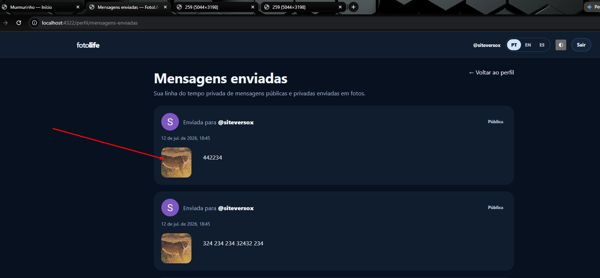

site-murm
Instrucoes

Voce pode ter a visao de conjunto antes
Mas Faca cada coisa de uma vez com cuidado e teste e nao duplique codigo
Vamos fazer uma alteracao por vez e eu vou confirmar uma por uma apois vc mandar o zip
Realize testes unitarios para garantir funcionamento

TODO, um de cada vez (verifique se ja existe o recurso e se precisa ser alterado melhorado ou corrigido e avise explique antes de gerar o zip):

- hoje tem a pagina do perfil dom o feed, mas preciso de uma pagina publica do perfil feed para apenas uma foto, para quando clicar na foto, onde tera so aquela foto e suas mensagens. inclusive qd clicar na foto em minhas msgs direcionar para esta nova pagina, exemplo  