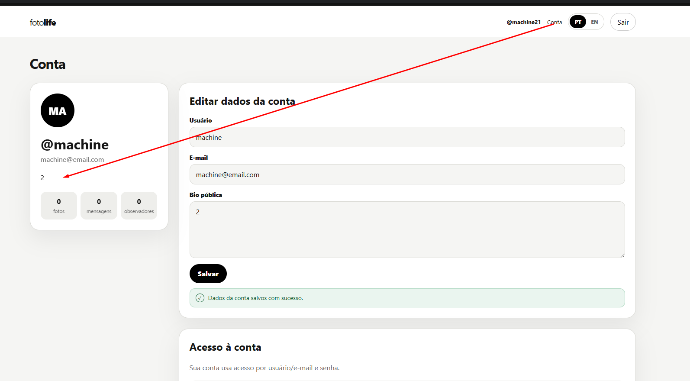
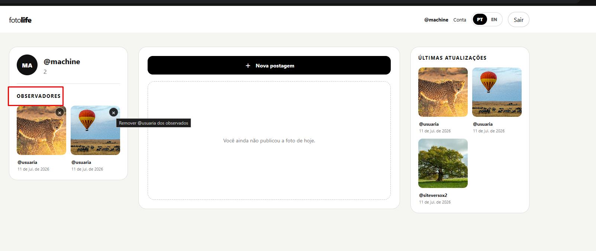
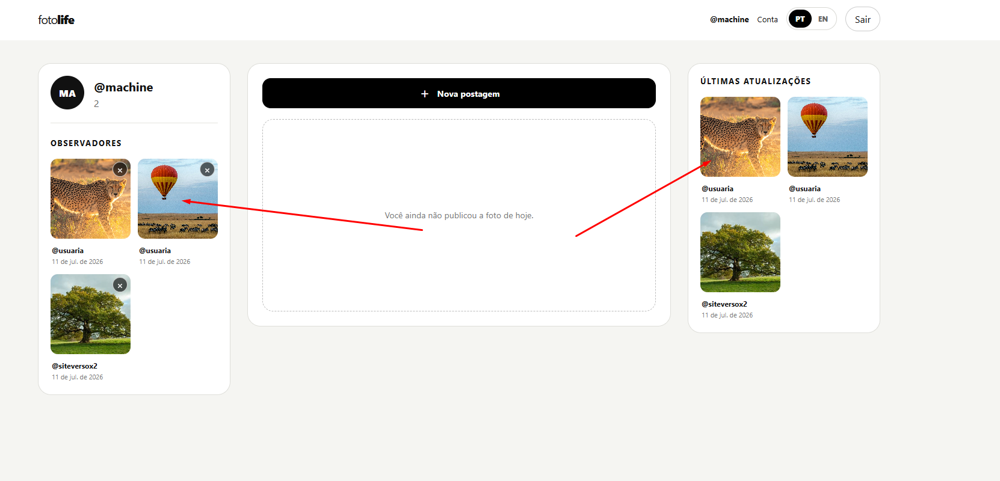
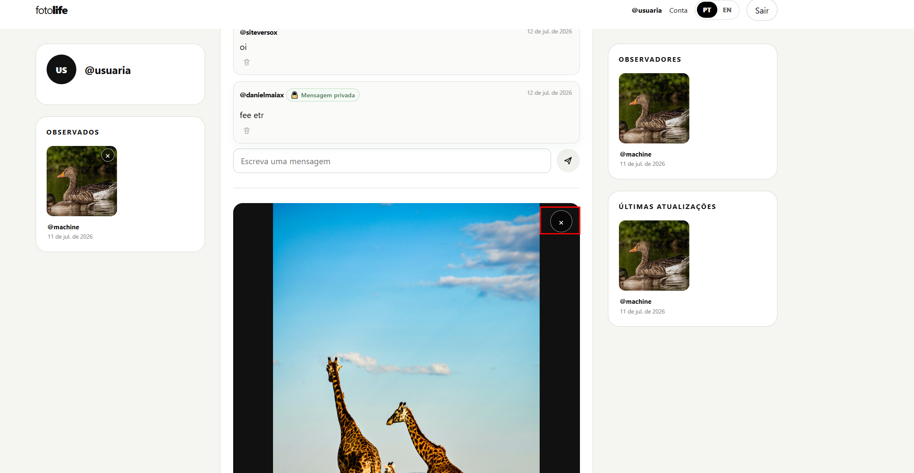

site-murm
Instrucoes

Voce pode ter a visao de conjunto antes
Mas Faca cada coisa de uma vez com cuidado e teste e nao duplique codigo
Vamos fazer uma alteracao por vez e eu vou confirmar uma por uma apois vc mandar o zip
Realize testes unitarios para garantir funcionamento

TODO, um de cada vez (verifique se ja existe o recurso e se precisa ser alterado melhorado ou corrigido e avise explique antes de gerar o zip):

- deve permitir ao proprietario editar o caption da imagem enviada
- deve ter um x nos observados para remover o observado da grade de observados direto e tambem dentro do perfil do amigo um x no botao amigo para remover ele
- deve ter um clique no popup da imagem do perfil para ver imagem circular da pessoa
- trocar o termo observados de forma geral 
- passar edicao da conta pra dentro do perfil ali na esquerda, qd for o proprietario claro 
- quando o perfil for meu o termo é Observando e nao observadores 
- so deve aparecer a ultima atualizacao da pessoa  para ter apenas uma entrada no grid
- pertmir que /@nomeusuario acesso o perfil do usuario 
- centralize 